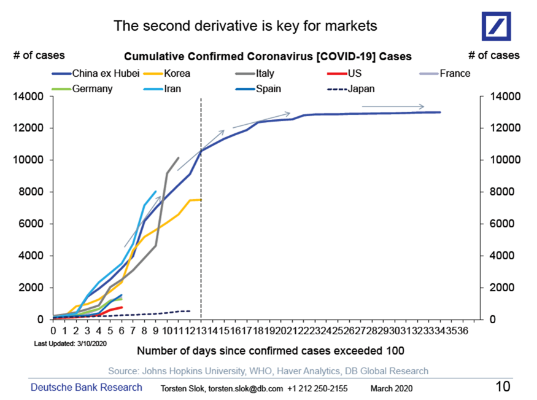
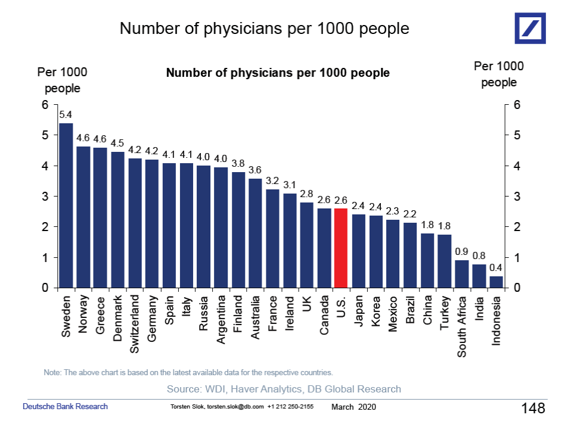
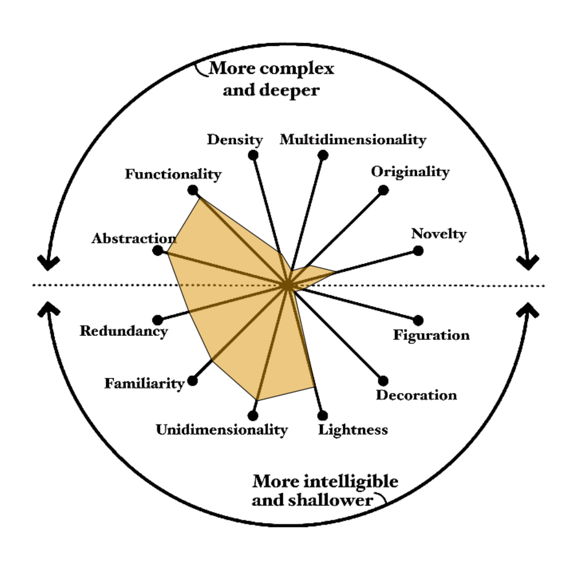
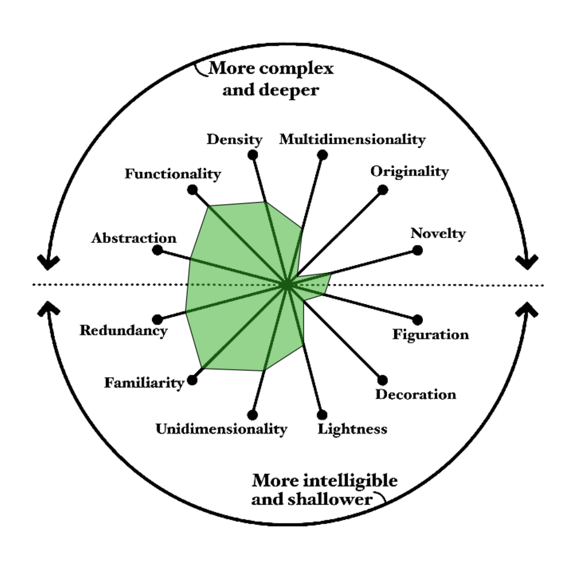

# **Analysis and Visualization of Complex Data**
## Exercise 2
Danilo III O. Gonzales (SN: 29225)  
Master's in Green Data Science

### Overview
In this exercise, two data visualization produced by the Deutsche Bank Research and authored by chief economist Torsten Slok were evaluated. The charts were published on March 2020 during the early stages of the COVID-19 Pandemic in the website article entitled ["Coronavirus: Facts & Charts on Covid-19"](https://ritholtz.com/2020/03/coronavirus-facts-charts/), written by Barry Ritholtz. Figure 1 and 2 are shown below.

**Figure 1**  
*Cumulative Confirmed Coronavirus [COVID-19] Cases*  

**Figure 2**  
*Number of Physicians per 1000 people*  

### Q1. Main visualization goal (audience)

**Figure 1**  
*Cumulative Confirmed Coronavirus [COVID-19] Cases*  

The main goal of the Figure 1 is to help its audience understand how fast COVID-19 is spreading in different countries and tell whether it's speeding up or slowing down. Since this was posted on a business institute, there is a huge chance that most of the people that visit the website are businessmen or investors and aside from showing the number of confirmed cases through time per country, this can also help them gather insight on which market might stabilize or worsen.

**Figure 2**  
*Number of Physicians per 1000 people*  

On the other hand, Figure 2 shows which countries have more or fewer doctors per person. It gives the audience the insight where different countries stand in terms of healthcare capacity. In this figure, the bar for the US was highlighted in red. This could be because Torsten Slok published the report for US-based clients. This emphasis in the figure helps them easily identify where US stands in the figure.

### Q2. Visualization dimensions using a visualization wheel

In this part, we will use Alberto Cairo's visualization wheel to evaluate both figures. Figures 3 and 4 show the visualization wheel created for Figure 1 and 2. Table 1 shows the explanation for the dimension score. It can be observed that Figure 1's wheel extends more on the upper half (complex/deep) while Figure 2 extends into the lower half (more intelligible and shallower).

**Figure 3**  
*Visualization Wheel for Figure 1: Cumulative Confirmed Coronavirus [COVID-19] Cases*  

**Figure 4**  
*Visualization Wheel for Figure 2: Number of Physicians per 1000 people*  

**Table 1**  
*Evaluation of Figure 1 and 2 based on Cairo's Visualization Wheel*
|Dimension|Figure 1|Figure 2|
|-|:-|:-|
|Abstraction vs. Figuration|Leans toward abstraction. No actual photos or objects were used and data was represented only using lines|Leans toward abstraction. No actual photos or objects were used and data was represented only using bar|
|Functionality vs. Decoration|Mostly functional. Every element serves its purpose except the arrows which doesn't help much and is more of an additional decoration.|Very functional. Only the usage of the red color to emphasize where US stands is more of a decoration since this is sort of an editorial's choice.|
|Density vs. Lightness|Dense. The graph shows data on nine countries in the span of 36 days. There's a lot going on and it takes more time to comprehend| Light. The graph consists of one number per country (n=22). It is much faster to digest.|
|Multidimensionality vs. Unidimensionality|Moderately multidimensional. It portrays three values: number of days (x-axis), number of COVID-19 cases (y-axis), and country (color of line).|Unidimensional. Only shows one thing which is the number of doctors per country.|
|Originality vs. Familiarity|Mostly familiar. It is a line chart which is one of the common graphs. The only difference is the usage of normalization based on the days since 100 cases.|Very familiar. Easy to read but nothing unique|
|Novelty vs. Redundancy|Redundant. The left and right y-axes shows the same scale, which adds nothing.| Redundant. There is already a number label on top of the bar so the y-axis is not necessary.|

### Q3. Main drawbacks following Alberto Cairo and Eduard Tufte recommendations and principles

**Figure 1**  
*Cumulative Confirmed Coronavirus [COVID-19] Cases*  

#### Drawbacks observed for Figure 1
1. The text with second derivative on the top of the figure is misleading since the graph does not show rate of change. It also exaggerates the dominance of high-count countries compared to what the data actually shows.
2. The chart uses both color and line style (dashed line was used for Japan, while solid for others). This can cause confusion since varying of line style can indicate a dimension that doesn't exist.
3. The arrows drawn on China's line are added features not based on the data itself. 
4. In terms of data-ink ratio, chart junks should be removed: redundant y-axis, x-axis labels for every single day which could just be in interval to make it look better, and the unlabeled dashed vertical line which doesn't give additional meaning to the graph.
5. The legend requires viewers to match colors across distance. Direct labeling should be done instead.
6. Using a log-scale is more appropriate to showcase the growth rate of COVID-19 cases. 

**Figure 2**  
*Number of Physicians per 1000 people*  

#### Drawbacks observed for Figure 2
1. All 22 countries shows the same data so all bars should have the same color. The red color bar of US portrays the concept of emphasis to steer viewer's interpretation rather than letting the data speak for itself. Although, this is acceptable if the author originally wants to draw the attention of the main audience (US clients) to where the US currently stands.
2. Since every bar has its value on top, both y-axes should be removed together with the horizontal ticks.
3. A confusing footnote was added. The author should clearly state when each data was obtained because the audience might compare countries using the data that may come from sources published at different years.
4. A horizontal bar chart should be more appropriate to increase readability. A horizontal bar chart would allow country names to be printed horizontally.

### Q4.  Graphical variables used and whether they are suitable or not for the purpose.

**Figure 1**  
*Cumulative Confirmed Coronavirus [COVID-19] Cases*  

Suitable variables in Figure 1:
- X-axis. The x-axis uses normalized values instead of actual calendar dates to allow fair comparison of growth rate.
- Y-axis. It is suitable but uses wrong scale. This should be log scale and not linear scale.
- Color hue of the line. Suitable but using nine colors makes it harder to interpret given that France uses light gray while Italy uses gray. Direct labeling should be done instead of labels to increase readability.

Not Suitable variables in Figure 1:
- Line style and weight. Introducing this variable adds additional confusion because audience might imply that there are other dimensions other than the three original dimensions.
- Arrows on some lines. These are just chartjunk since they are just added there without giving additional meaning to the graph.
- Dual Y-axis. Not suitable since both axes show the same value.
- X-axis labels. Labeling every single day creates clutter and using intervals (3 to 5 days intervals) will make it look cleaner.

**Figure 2**  
*Number of Physicians per 1000 people*  

Suitable variables in Figure 2:
- Bar length. Representation is directly proportional to the number of doctors per 1000 person.
- Ranking of countries from left to right. The ranking immediately showed the ranking and comparison is easier.
- Color hue. It is partially suitable. The author probably wants to emphasize the US since they cater to USA as its primary audience but in terms of the best practice for data visualization, this adds no value because it does not represent another data category.
- Direct labels. Printed labels at the top of the bar follows the best practice.
- X-axis labels. Suitable but could be better by doing horizontal bar graphs, as explained before.

Not Suitable variables in Figure 2:
- Horizontal ticks and grid lines. With direct labeling, the horizontal gridline is now just a chart junk. 
- Bar orientation. Horizontal bar chart is more suitable to allow countries to be written horizontally.
- Dual Y-axis. This should be removed since direct labeling was already performed.
